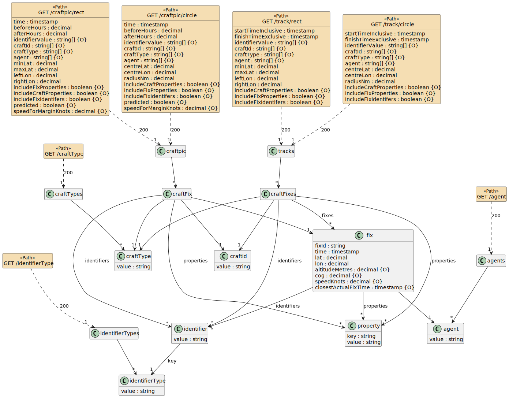
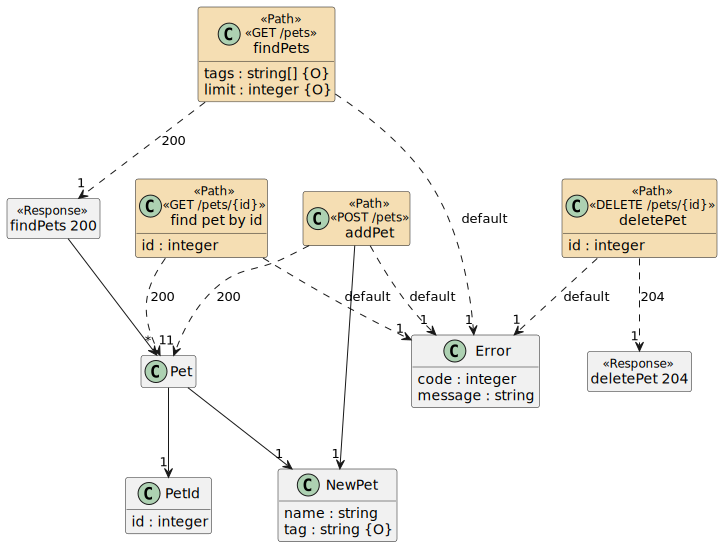
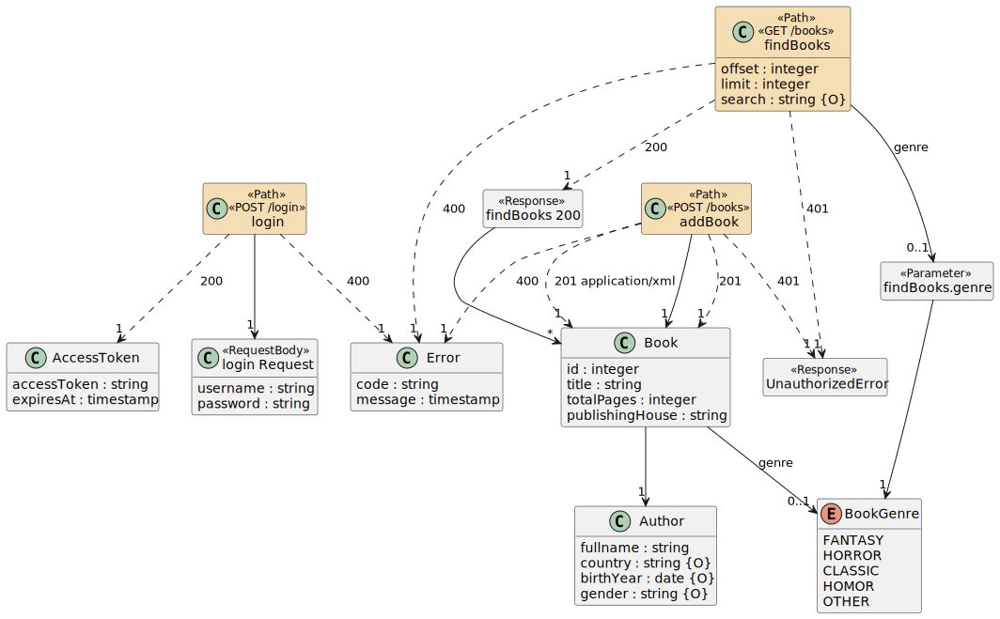
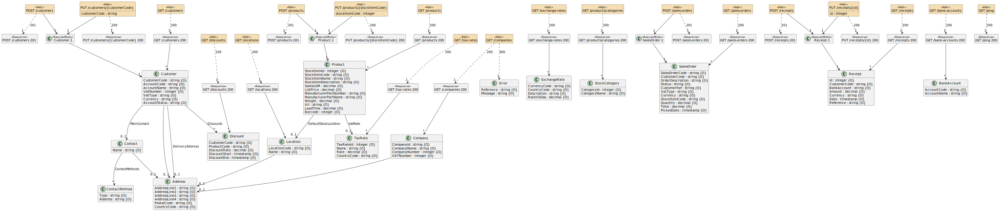
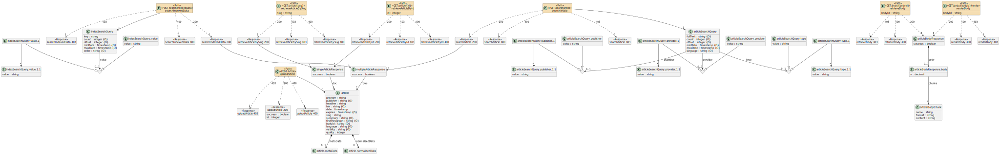
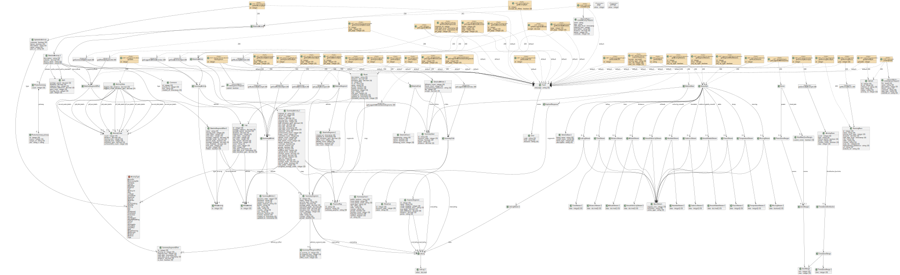
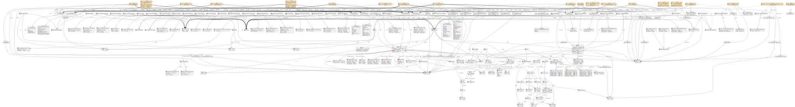
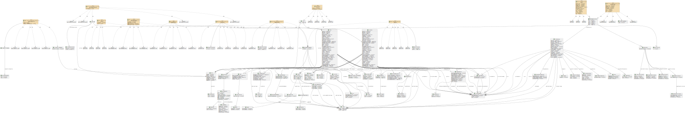

# openapi-to-plantuml
<a href="https://github.com/davidmoten/openapi-to-plantuml/actions/workflows/ci.yml"></a><br/>
[](https://codecov.io/gh/davidmoten/openapi-to-plantuml)<br/>
[](https://maven-badges.herokuapp.com/maven-central/com.github.davidmoten/openapi-to-plantuml)<br/>

Java library and Maven plugin to generate a [PlantUML](https://plantuml.com) Class Diagram (supplemented with path information) from an OpenAPI 3.0 definition (YAML or JSON). 

Try it online [here](https://openapi-to-puml.davidmoten.org/prod/site/index.html).

**Features**

* Maven plugin to produce diagrams in multiple formats
* One consolidated diagram or diagram-per-operation options
  
Supports all features of OpenAPI 3.0 including

* Mixed types (*oneOf*, *anyOf*, *allOf*) 
* Multiple levels of indirection (`$ref` -> `$ref` for example) 
* Multiple response content types
* Can produce diagram-per-path (great for large APIs)

**Status:** Released to Maven Central 

**Limitations**

* Only handles internal references ("#/*"), that is the yaml file should be self-contained. As of 0.1.9 external refs are displayed but not exploded. Full external reference support is being considered.

**TODO**
* Model *Callbacks*
* Model *additionalProperties*

[openapi-example.yml](src/test/resources/openapi-example.yml): 



## How to build

```bash
mvn clean install
```

## Getting started

### Online diagram generator (SINGLE style only)
The easiest thing to do is to use the [online diagram generator](https://openapi-to-puml.davidmoten.org/prod/site/index.html). If your definition is large then PlantText may refuse to render it (the Plant UML text is encoded and added to the PlantText url which can get too long). 

To trial quickly, clone this repo and add your yaml file to `src/test/resources/demo/` directory and run `mvn test`. The generated image will be saved in `target/demos`.

### Maven Plugin
Use the Maven plugin:

```xml
<plugin>
    <groupId>com.github.davidmoten</groupId>
    <artifactId>openapi-to-plantuml-maven-plugin</artifactId>
    <version>VERSION_HERE</version>
    <executions>
        <execution>
            <id>generate-split</id>
            <goals>
                <goal>generate</goal>
            </goals>
            <configuration>
                <style>SPLIT</style> <!-- one diagram per operation -->
                <input>src/main/openapi/openapi.yml</input>
                <formats>
                    <format>PNG</format>
                    <format>SVG</format>
                </formats>
            </configuration>
        </execution>
    </executions>
</plugin>
```
| Parameter | Type          | Required | Default                          | Description |
|-----------|---------------|----------|----------------------------------|-------------|
| `style`   | `Style`       | No       | `SPLIT`                          | The style of the generated diagrams. `SINGLE` creates one diagram for all operations, while `SPLIT` creates a separate diagram per operation (recommended for large OpenAPI specs). |
| `input`   | `File`        | Yes      | –                                | The source OpenAPI file to generate diagrams from. Can include relative references to other files. |
| `formats` | `List<String>`| No       | PNG, SVG                         | Output formats. Possible values include: `PUML`, `EPS`, `SVG`, `PDF`, `PNG`, `HTML`, etc. |
| `output`  | `File`        | No       | `target/diagrams/class-diagram.png` (for `SINGLE`) or `target/diagrams` (for `SPLIT`) | The output file (for `SINGLE`) or output directory (for `SPLIT`). |

### Standalone jar

An alternative to the maven plugin is to use the standalone *jar-with-dependencies* artifact from [Maven Central](https://search.maven.org/search?q=g:com.github.davidmoten%20AND%20a:openapi-to-plantuml) (or from the `target` directory if you have built the project locally):

```bash
java -jar openapi-to-plantuml-VERSION_HERE-jar-with-dependencies.jar single openapi.yaml PNG openapi.png
```
Large diagrams are better with SVG format (rendering is sharp at every zoom level) so just replace `PNG` in the above command with `SVG`. If you still want a PNG and you find it 
is getting cut off then you need to increase the plantuml image size limit like below. Increase the limit till your diagram fits. You may need to increase memory using this JVM arg `-Xmx1024m`.

```bash
java -DPLANTUML_LIMIT_SIZE=8192 -jar openapi-to-plantuml-VERSION_HERE-jar-with-dependencies.jar openapi.yaml PNG openapi.png
```

### How to produce a diagram per service method

```bash
java -jar openapi-to-plantuml-VERSION_HERE-jar-with-dependencies.jar split openapi.yaml PNG diagrams
```
The above call will write a diagram per method into the `diagrams` directory (and will create it if it doesn't exist). 

As an example, do `mvn clean test` on the project and look in `target/unqork.svg` directory.

## Usage

```java
import com.github.davidmoten.oas3.puml.Converter;

String puml = Converter.openApiToPuml(openapi);
```

## System properties
* `max.enum.entries` defaults to 12. If an enum has more than the max then it will be limited to that number and an entry `...` will appear at the end of the enums.

## Examples

Unit test examples are [here](openapi-to-plantuml/src/docs/generated/examples.md).

[petstore-expanded.yml](openapi-to-plantuml/src/test/resources/inputs/petstore-expanded.yml):



[bookstore.yml](openapi-to-plantuml/src/test/resources/demos/bookstore.yml):



[ecommerce.yml](openapi-to-plantuml/src/test/resources/demos/ecommerce.yml)



[news.yml](openapi-to-plantuml/src/test/resources/demos/news.yml):



[strava.yml](openapi-to-plantuml/src/test/resources/demos/strava.yml):



[twitter.yml](openapi-to-plantuml/src/test/resources/demos/twitter.yml):



[ebay.yml](openapi-to-plantuml/src/test/resources/demos/ebay.yml):



