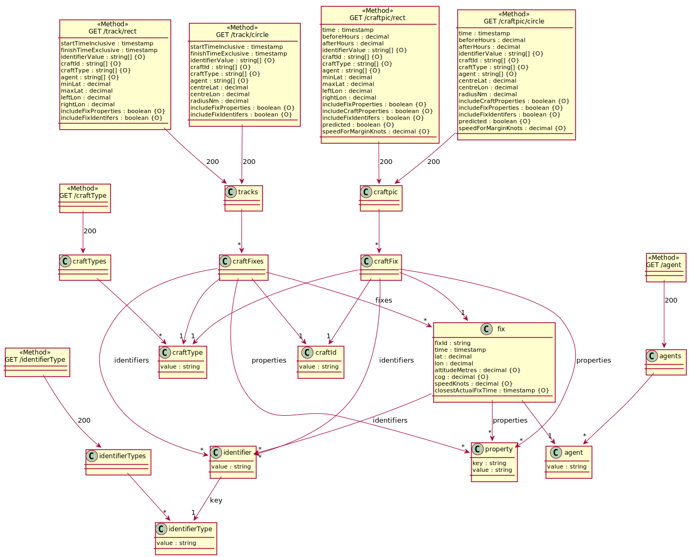

# openapi-to-plantuml
Java library to generate a [PlantUML](https://plantuml.com) Class Diagram (merged with paths) from an OpenAPI 3.0 definition (YAML or JSON).

This library makes big assumptions about the style that the definition uses. In particular it expects:

* No anonymous object structures (declare each structure as a schema)
* It only consumes the first response content (but uses all responses) 
* Members of a mixed type (`oneOf`, `anyOf`, `allOf`) should be `$ref` (to add meaning to the generated diagram)

You can infer more about the style I'm preferring by looking at [openapi-example.yml](src/test/resources/openapi-example.yml). 

The corresponding Class Diagram (supplemented with Path operations) is (best viewed with a light background colour):



## Getting started
Add this dependency to your pom.xml:

```xml
<dependency>
  <groupId>com.github.davidmoten</groupId>
  <artifactId>openapi-to-plantuml</artifactId>
  <version>VERSION_HERE</version>
</dependency>
```

## Usage

```java
String puml = Puml.openApiToPuml(openapi);
```


