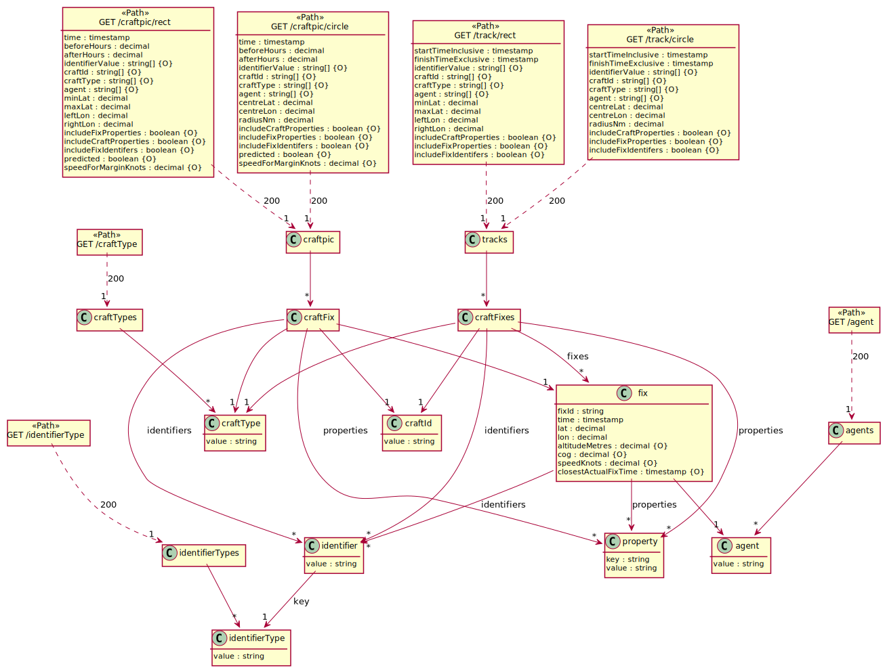
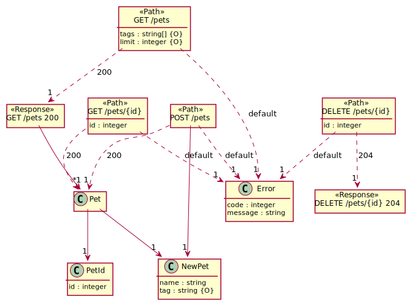
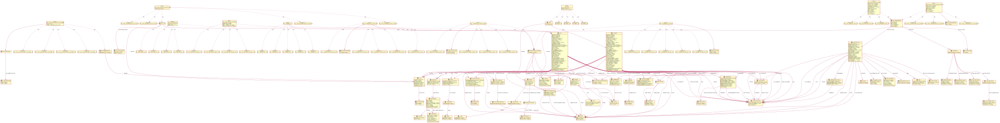

# openapi-to-plantuml
Java library to generate a [PlantUML](https://plantuml.com) Class Diagram (supplemented with path informations) from an OpenAPI 3.0 definition (YAML or JSON).

**Features**

Supports all features of OpenAPI 3.0 including

* Mixed types (*oneOf*, *anyOf*, *allOf*)  

**Limitations**

* It only consumes the first response content (but uses all responses).
* Only handles internal references ("#/*")  

[openapi-example.yml](src/test/resources/openapi-example.yml): 



## Getting started
Add this dependency to your pom.xml:

```xml
<dependency>
  <groupId>com.github.davidmoten</groupId>
  <artifactId>openapi-to-plantuml</artifactId>
  <version>VERSION_HERE</version>
</dependency>
```

## Usage

```java
import 
String puml = Convertor.openApiToPuml(openapi);
```

## Examples

Unit test examples are [here](src/docs/examples.md).

[petstore-expanded.yml](src/test/resources/inputs/petstore-expanded.yml):



[bookstore.yml](src/test/resources/demos/bookstore.yml):


[ecommerce.yml](src/test/resources/demos/ecommerce.yml)


[news.yml](src/test/resources/demos/news.yml):


[strava.yml](src/test/resources/demos/strava.yml):


[twitter.yml](src/test/resources/demos/twitter.yml):


[ebay.yml](src/test/resources/demos/ebay.yml):



