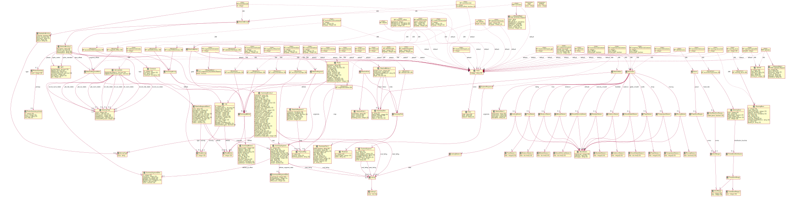

# openapi-to-plantuml

<a href="https://github.com/davidmoten/openapi-to-plantuml/actions/workflows/ci.yml"></a><br/>
[](https://codecov.io/gh/davidmoten/openapi-to-plantuml)<br/>
[](https://maven-badges.herokuapp.com/maven-central/com.github.davidmoten/openapi-to-plantuml)<br/>

Java library to generate a [PlantUML](https://plantuml.com) Class Diagram (supplemented with path information) from an
OpenAPI 3.0 definition (YAML or JSON). Try it online [here](https://openapi-to-puml.davidmoten.org/prod/site/index.html)
.

**Features**

Supports all features of OpenAPI 3.0 including

* Mixed types (*oneOf*, *anyOf*, *allOf*)
* Multiple levels of indirection (`$ref` -> `$ref` for example)
* Multiple response content types

**Status:** Released to Maven Central

**Limitations**

* Only handles internal references ("#/*"), that is the yaml file should be self-contained

**TODO**

* Model *Callbacks*
* Model *additionalProperties*

[openapi-example.yml](src/test/resources/openapi-example.yml):


## How to build

```bash
mvn clean install
```

## How to quickly convert your OpenAPI definition

The easiest thing to do is to use the [online converter](https://openapi-to-puml.davidmoten.org/prod/site/index.html).
If your definition is large then PlantText may refuse to render it (the Plant UML text is encoded and added to the
PlantText url which can get too long). In that case just add your yaml file to `src/test/resources/demo/` directory and
run `mvn test`. The generated image will be saved in `target/demos`.

## Getting started

Add this dependency to your pom.xml:

```xml
<dependency>
  <groupId>com.github.davidmoten</groupId>
  <artifactId>openapi-to-plantuml</artifactId>
  <version>2022-01-01-SNAPSHOT</version>
</dependency>
```

Or use the standalone *jar-with-dependencies* artifact
from [Maven Central](https://search.maven.org/search?q=g:com.github.davidmoten%20AND%20a:openapi-to-plantuml) (or from
the `target` directory if you have built the project locally):

## Usage

Read com.github.davidmoten.oas3.puml.ConverterMainTest for more examples

```bash
Usage:
java -jar openapi-to-plantuml-all.jar <OPENAPI_YAML> <OUTPUT_DIRECTORY> <FILE_FORMAT>|<[FILE_FORMAT1, FILE_FORMAT1...]>
<OPENAPI_YAML> file or Directory containing *.yml or *.yaml files
<OUTPUT_DIRECTORY> output Directory
<FILE_FORMAT> optional file format default PUML and SVG only
 or<[FILE_FORMAT1, FILE_FORMAT1...]> optional several file formats
surrounded by [delimited by comma and space ', ')] i.e. supported formats are:
[ATXT, BRAILLE_PNG, DEBUG, EPS, EPS_TEXT, LATEX, LATEX_NO_PREAMBLE, PNG, SVG, UTXT, VDX]
ATXT	*.atxt	text/plain
BRAILLE_PNG	*.braille.png	image/png
DEBUG	*.debug	text/plain
EPS	*.eps	application/postscript
EPS_TEXT	*.eps.text.eps	application/postscript
LATEX	*.latex	application/x-latex
LATEX_NO_PREAMBLE	*.latex.no.preamble.latex	application/x-latex
PNG	*.png	image/png
SVG	*.svg	image/svg+xml
UTXT	*.utxt	text/plain;charset=UTF-8
VDX	*.vdx	application/vnd.visio.xml
```

all demo files at src/test/resources/demo to target/converted-puml as PUML & SVG by default

```bash
java -jar target/openapi-to-plantuml-2022-01-01-SNAPSHOT-jar-with-dependencies.jar src/test/resources/demo target/converted-puml
```

all demo files at src/test/resources/demo to target/converted-puml as PUML, SVG & PNG

```bash
java -jar target/openapi-to-plantuml-2022-01-01-SNAPSHOT-jar-with-dependencies.jar src/test/resources/demo target/converted-puml "[SVG, PNG]"
```

## Usage

Read com.github.davidmoten.oas3.puml.DemoJavaTest for more examples All supported formats

```java
import com.github.davidmoten.oas3.puml.Converter;
Converter.writeOpenApiDirectoryFileToPumlAndTo(OPEN_API_DIRECTORY_FILE,
				OUTPUT_DIRECTORY_FILE,
				Converter.SUPPORTED_FORMATS);
```

PUML, SVG & PNG

```java
Converter.writeOpenApiDirectoryFileToPumlAndTo(OPEN_API_DIRECTORY_FILE,
                                               OUTPUT_DIRECTORY_FILE,
                                               FileFormat.SVG,
                                               FileFormat.PNG);
```

## Examples

Unit test examples are [here](src/docs/examples.md).

[petstore-expanded.yml](src/test/resources/inputs/petstore-expanded.yml):


[bookstore.yml](src/test/resources/demos/bookstore.yml):


[ecommerce.yml](src/test/resources/demos/ecommerce.yml)


[news.yml](src/test/resources/demos/news.yml):


[strava.yml](src/test/resources/demos/strava.yml):



[twitter.yml](src/test/resources/demos/twitter.yml):


[ebay.yml](src/test/resources/demos/ebay.yml):


