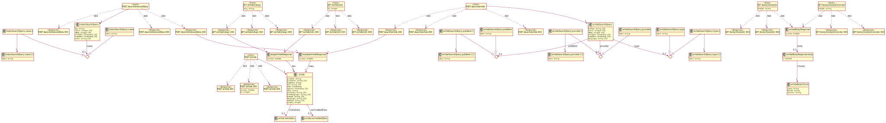
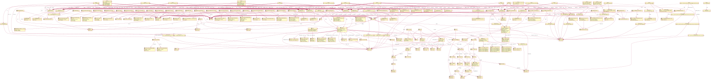

# openapi-to-plantuml
<a href="https://github.com/davidmoten/openapi-to-plantuml/actions/workflows/ci.yml"></a><br/>
[](https://codecov.io/gh/davidmoten/openapi-to-plantuml)<br/>
[](https://maven-badges.herokuapp.com/maven-central/com.github.davidmoten/openapi-to-plantuml)<br/>

Java library to generate a [PlantUML](https://plantuml.com) Class Diagram (supplemented with path information) from an OpenAPI 3.0 definition (YAML or JSON).

**Features**

Supports all features of OpenAPI 3.0 including

* Mixed types (*oneOf*, *anyOf*, *allOf*) 
* Multiple levels of indirection (`$ref` -> `$ref` for example) 
* Multiple response content types

**Status:** Released to Maven Central 

**Limitations**

* Only handles internal references ("#/*"), that is the yaml file should be self-contained

**TODO**
* Model *Callbacks*
* Model *additionalProperties*

[openapi-example.yml](src/test/resources/openapi-example.yml): 


## How to build

```bash
mvn clean install
```

## Getting started
Add this dependency to your pom.xml:

```xml
<dependency>
  <groupId>com.github.davidmoten</groupId>
  <artifactId>openapi-to-plantuml</artifactId>
  <version>VERSION_HERE</version>
</dependency>
```

Or use the standalone *jar-with-dependencies* artifact from [Maven Central](https://search.maven.org/search?q=g:com.github.davidmoten%20AND%20a:openapi-to-plantuml) (or from the `target` directory if you have built the project locally):

```bash
java -jar openapi-to-plantuml-VERSION_HERE-jar-with-dependencies.jar openapi.yaml PNG openapi.png
```

## Usage

```java
import com.github.davidmoten.oas3.puml.Converter;

String puml = Converter.openApiToPuml(openapi);
```

## Examples

Unit test examples are [here](src/docs/examples.md).

[petstore-expanded.yml](src/test/resources/inputs/petstore-expanded.yml):


[bookstore.yml](src/test/resources/demos/bookstore.yml):


[ecommerce.yml](src/test/resources/demos/ecommerce.yml)


[news.yml](src/test/resources/demos/news.yml):



[strava.yml](src/test/resources/demos/strava.yml):


[twitter.yml](src/test/resources/demos/twitter.yml):



[ebay.yml](src/test/resources/demos/ebay.yml):


