## openapi-to-plantuml examples

* [empty-3.1.yml](../../../src/test/resources/inputs/empty-3.1.yml)

* [array-property-level.yml](../../../src/test/resources/inputs/array-property-level.yml)

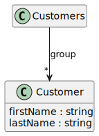

* [one-of-property-level.yml](../../../src/test/resources/inputs/one-of-property-level.yml)

* [array-anon-property-level-3.1.yml](../../../src/test/resources/inputs/array-anon-property-level-3.1.yml)

* [any-of-property-level.yml](../../../src/test/resources/inputs/any-of-property-level.yml)

* [parameter-anon-3.1.yml](../../../src/test/resources/inputs/parameter-anon-3.1.yml)

* [one-of-class-level.yml](../../../src/test/resources/inputs/one-of-class-level.yml)

* [one-of-property-level-3.1.yml](../../../src/test/resources/inputs/one-of-property-level-3.1.yml)

* [anon-nested-class-level-3.1.yml](../../../src/test/resources/inputs/anon-nested-class-level-3.1.yml)

* [anon-nested-class-level.yml](../../../src/test/resources/inputs/anon-nested-class-level.yml)

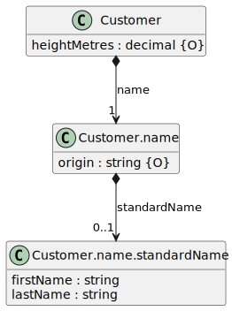

* [request-body-ref.yml](../../../src/test/resources/inputs/request-body-ref.yml)

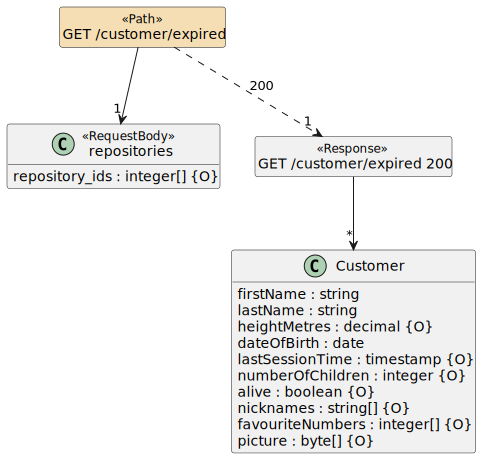

* [array-class-level.yml](../../../src/test/resources/inputs/array-class-level.yml)

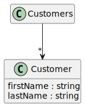

* [anon-property-required-3.1.yml](../../../src/test/resources/inputs/anon-property-required-3.1.yml)

* [path-returns-ref-3.1.yml](../../../src/test/resources/inputs/path-returns-ref-3.1.yml)

* [petstore-3.1.yml](../../../src/test/resources/inputs/petstore-3.1.yml)

* [array-anon-class-level.yml](../../../src/test/resources/inputs/array-anon-class-level.yml)

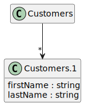

* [parameter-anon-empty-object.yml](../../../src/test/resources/inputs/parameter-anon-empty-object.yml)

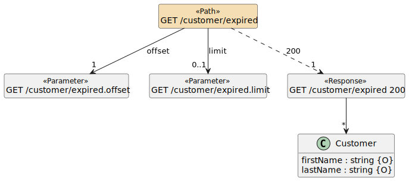

* [anon-property-required.yml](../../../src/test/resources/inputs/anon-property-required.yml)

* [simple-has-refs.yml](../../../src/test/resources/inputs/simple-has-refs.yml)

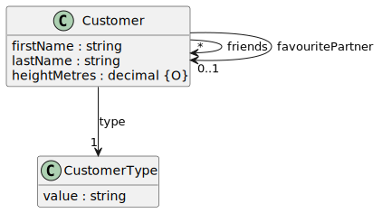

* [additional-properties-simple.yml](../../../src/test/resources/inputs/additional-properties-simple.yml)

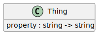

* [one-of-class-level-3.1.yml](../../../src/test/resources/inputs/one-of-class-level-3.1.yml)

* [one-of-property-level-required-3.1.yml](../../../src/test/resources/inputs/one-of-property-level-required-3.1.yml)

* [path-returns-ref-ref-3.1.yml](../../../src/test/resources/inputs/path-returns-ref-ref-3.1.yml)

* [all-of-property-level-3.1.yml](../../../src/test/resources/inputs/all-of-property-level-3.1.yml)

* [petstore.yml](../../../src/test/resources/inputs/petstore.yml)

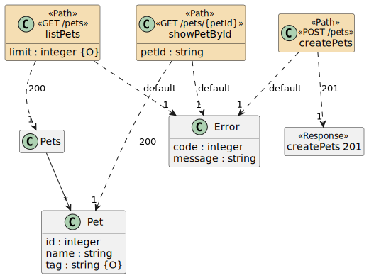

* [one-of-class-level-empty-3.1.yml](../../../src/test/resources/inputs/one-of-class-level-empty-3.1.yml)

* [all-of-class-level.yml](../../../src/test/resources/inputs/all-of-class-level.yml)

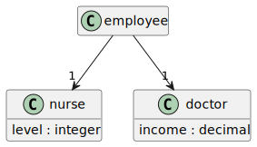

* [ref-class-level-3.1.yml](../../../src/test/resources/inputs/ref-class-level-3.1.yml)

* [request-body-3.1.yml](../../../src/test/resources/inputs/request-body-3.1.yml)

* [path-returns-ref-ref2.yml](../../../src/test/resources/inputs/path-returns-ref-ref2.yml)

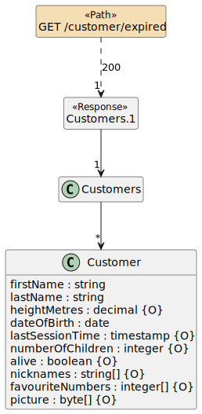

* [array-class-level-3.1.yml](../../../src/test/resources/inputs/array-class-level-3.1.yml)

* [one-of-class-level-empty.yml](../../../src/test/resources/inputs/one-of-class-level-empty.yml)

* [ref-class-level.yml](../../../src/test/resources/inputs/ref-class-level.yml)

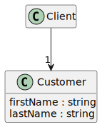

* [parameter-ref-complex.yml](../../../src/test/resources/inputs/parameter-ref-complex.yml)

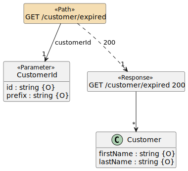

* [any-of-property-level-3.1.yml](../../../src/test/resources/inputs/any-of-property-level-3.1.yml)

* [enum.yml](../../../src/test/resources/inputs/enum.yml)

* [additional-properties-complex.yml](../../../src/test/resources/inputs/additional-properties-complex.yml)

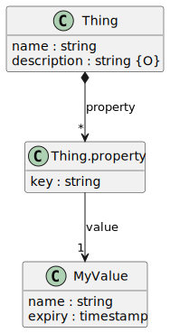

* [any-of-anon-property-level.yml](../../../src/test/resources/inputs/any-of-anon-property-level.yml)

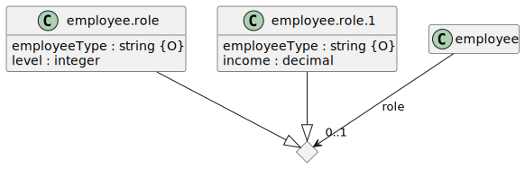

* [any-of-anon-class-level.yml](../../../src/test/resources/inputs/any-of-anon-class-level.yml)

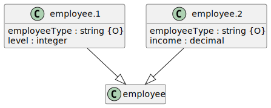

* [additional-properties-complex-3.1.yml](../../../src/test/resources/inputs/additional-properties-complex-3.1.yml)

* [parameter-anon.yml](../../../src/test/resources/inputs/parameter-anon.yml)

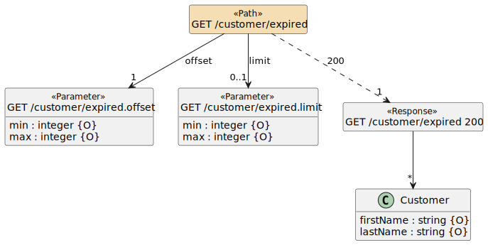

* [any-of-class-level.yml](../../../src/test/resources/inputs/any-of-class-level.yml)

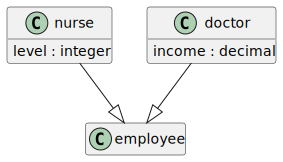

* [all-of-property-level.yml](../../../src/test/resources/inputs/all-of-property-level.yml)

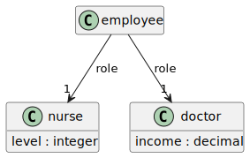

* [any-of-anon-class-level-3.1.yml](../../../src/test/resources/inputs/any-of-anon-class-level-3.1.yml)

* [parameter-ref-ref.yml](../../../src/test/resources/inputs/parameter-ref-ref.yml)

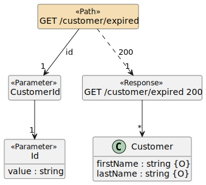

* [one-of-property-level-required.yml](../../../src/test/resources/inputs/one-of-property-level-required.yml)

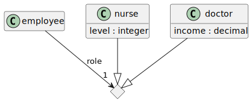

* [simple-has-refs-3.1.yml](../../../src/test/resources/inputs/simple-has-refs-3.1.yml)

* [parameter-ref.yml](../../../src/test/resources/inputs/parameter-ref.yml)

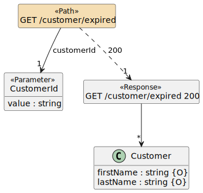

* [path-returns-non-ref.yml](../../../src/test/resources/inputs/path-returns-non-ref.yml)

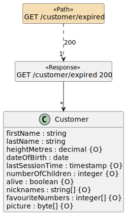

* [simple-types-and-arrays.yml](../../../src/test/resources/inputs/simple-types-and-arrays.yml)

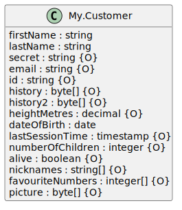

* [array-property-level-3.1.yml](../../../src/test/resources/inputs/array-property-level-3.1.yml)

* [all-of-class-level-3.1.yml](../../../src/test/resources/inputs/all-of-class-level-3.1.yml)

* [simple-types-and-arrays-3.1.yml](../../../src/test/resources/inputs/simple-types-and-arrays-3.1.yml)

* [external-ref-3.1.yml](../../../src/test/resources/inputs/external-ref-3.1.yml)

* [parameter-ref-3.1.yml](../../../src/test/resources/inputs/parameter-ref-3.1.yml)

* [request-body-ref-3.1.yml](../../../src/test/resources/inputs/request-body-ref-3.1.yml)

* [request-body-ref-ref-3.1.yml](../../../src/test/resources/inputs/request-body-ref-ref-3.1.yml)

* [anon-property-not-required.yml](../../../src/test/resources/inputs/anon-property-not-required.yml)

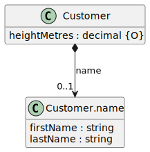

* [path-returns-ref.yml](../../../src/test/resources/inputs/path-returns-ref.yml)

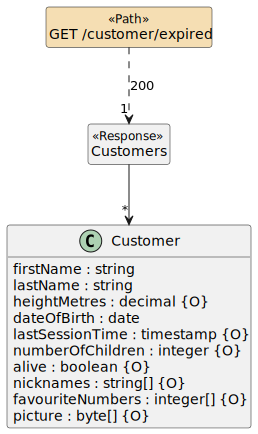

* [request-body.yml](../../../src/test/resources/inputs/request-body.yml)

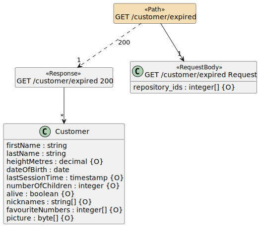

* [parameter-ref-ref-3.1.yml](../../../src/test/resources/inputs/parameter-ref-ref-3.1.yml)

* [petstore-expanded-3.1.yml](../../../src/test/resources/inputs/petstore-expanded-3.1.yml)

* [array-anon-property-level.yml](../../../src/test/resources/inputs/array-anon-property-level.yml)

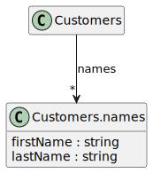

* [additional-properties-simple-3.1.yml](../../../src/test/resources/inputs/additional-properties-simple-3.1.yml)

* [any-of-class-level-3.1.yml](../../../src/test/resources/inputs/any-of-class-level-3.1.yml)

* [any-of-anon-property-level-3.1.yml](../../../src/test/resources/inputs/any-of-anon-property-level-3.1.yml)

* [anon-property-not-required-3.1.yml](../../../src/test/resources/inputs/anon-property-not-required-3.1.yml)

* [empty.yml](../../../src/test/resources/inputs/empty.yml)

* [external-ref.yml](../../../src/test/resources/inputs/external-ref.yml)

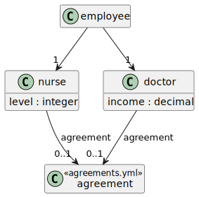

* [path-returns-ref-ref2-3.1.yml](../../../src/test/resources/inputs/path-returns-ref-ref2-3.1.yml)

* [path-returns-non-ref-3.1.yml](../../../src/test/resources/inputs/path-returns-non-ref-3.1.yml)

* [parameter-ref-complex-3.1.yml](../../../src/test/resources/inputs/parameter-ref-complex-3.1.yml)

* [enum-3.1.yml](../../../src/test/resources/inputs/enum-3.1.yml)

* [path-returns-ref-ref.yml](../../../src/test/resources/inputs/path-returns-ref-ref.yml)

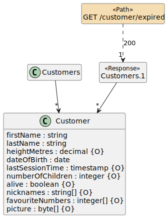

* [array-anon-class-level-3.1.yml](../../../src/test/resources/inputs/array-anon-class-level-3.1.yml)

* [petstore-expanded.yml](../../../src/test/resources/inputs/petstore-expanded.yml)

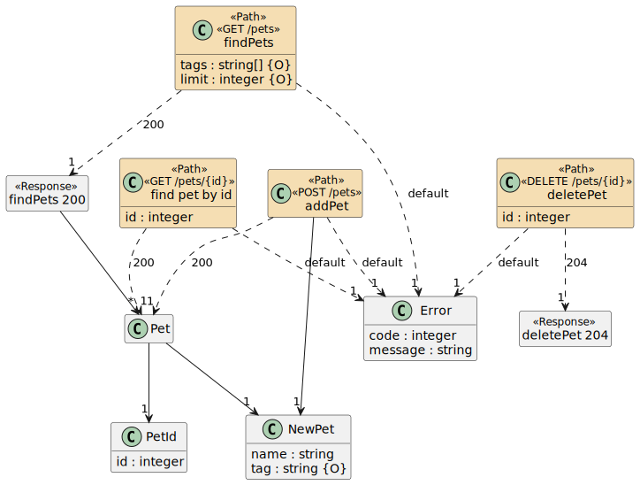

* [parameter-anon-empty-object-3.1.yml](../../../src/test/resources/inputs/parameter-anon-empty-object-3.1.yml)

* [request-body-ref-ref.yml](../../../src/test/resources/inputs/request-body-ref-ref.yml)

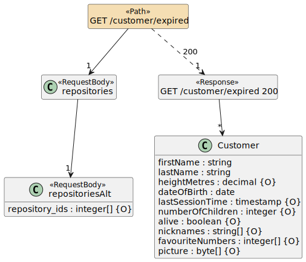